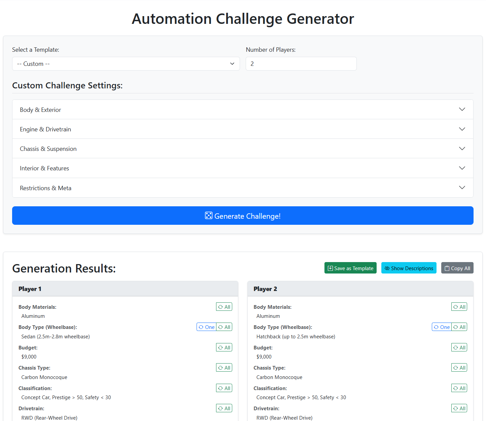

# Automation Challenge Generator

[](https://www.python.org/downloads/)
[](https://flask.palletsprojects.com/)
[](https://getbootstrap.com/)
[](https://opensource.org/licenses/MIT)

A web application for generating gameplay challenges for the car-building game, *Automation: The Car Company Tycoon Game*. It helps players create unique and structured design briefs, either from pre-defined templates or by using a highly customizable rule-based system.

This project is built with Flask and uses a dynamic, AJAX-powered frontend to provide a smooth user experience without page reloads.

---

## Table of Contents
- [Features](#features)
- [Screenshot](#screenshot)
- [Tech Stack](#tech-stack)
- [Installation and Setup](#installation-and-setup)
- [Usage](#usage)
- [Project Structure](#project-structure)
- [Contributing](#contributing)
- [License](#license)

---

## Features

-   **Template-Based Generation**: Quickly generate challenges using pre-defined templates.
-   **Custom Rule Builder**: Create your own challenge rules for any category.
    -   Select a random value from all available options in a category.
    -   Select a random value from a user-defined list.
    -   Select a fixed, specific value.
    -   Generate a random number within a specified range (e.g., for budget or year).
-   **Multi-Player Support**: Generate unique (or the same) constraints for up to 10 players at once.
-   **Dynamic UI**: The interface is powered by AJAX, allowing for fast generation and "rerolls" without reloading the page.
-   **Reroll Functionality**:
    -   Reroll a specific category for a single player.
    -   Reroll a specific category and apply the new value to all players.
-   **Save Custom Templates**: Save your custom-built rule configurations as new templates for future use.
-   **Organized Interface**: Categories are grouped logically (e.g., "Body & Exterior", "Engine & Drivetrain") in an accordion for easy navigation.

---

## Screenshot

*(Here you should place a screenshot of the application's main interface, showing the form and the generated results)*



---

## Tech Stack

-   **Backend**: Python 3, Flask, Flask-SQLAlchemy, Flask-Migrate
-   **Frontend**: JavaScript (ES6+), Bootstrap 5.3, HTML5, CSS3
-   **Database**: SQLite (default), easily configurable for PostgreSQL.

---

## Installation and Setup

Follow these steps to get the application running on your local machine.

### 1. Prerequisites
-   Python 3.8 or newer
-   `pip` package installer

### 2. Clone the Repository
```bash
git clone https://github.com/your-username/your-repo-name.git
cd your-repo-name
```

### 3. Create and Activate a Virtual Environment
It is highly recommended to use a virtual environment to manage project dependencies.

-   **On macOS/Linux:**
    ```bash
    python3 -m venv venv
    source venv/bin/activate
    ```
-   **On Windows:**
    ```bash
    python -m venv venv
    .\venv\Scripts\activate
    ```

### 4. Install Dependencies
```bash
pip install -r requirements.txt
```

### 5. Initialize the Database
This is a one-time command that sets up the database schema and populates it with initial data from `ready_data.json`.

```bash
flask init-app
```
This command will:
1.  Apply any existing database migrations.
2.  Seed the database with all the categories and values needed for the generator.

### 6. Run the Application
```bash
flask run
```
The application will be available at `http://127.0.0.1:5000`.

---

## Usage

Once the application is running, open it in your browser.

-   **To Generate**: Select a template or choose "Custom" to build your own rules. Set the number of players and click the "Generate Challenge!" button.
-   **To Reroll**: In the results area, each category has reroll buttons.
    -   The `One` button rerolls the value for that specific player only (if the "apply to all" rule wasn't used for that category).
    -   The `All` button rerolls the value and updates it for every player.
-   **To Save a Template**: After generating from a "Custom" configuration, a "Save as Template" button will appear. Click it to save your current rules for later use.

### Available CLI Commands
-   `flask init-app`: The all-in-one command for first-time setup. Creates the database and seeds it.
-   `flask db upgrade`: Applies the latest database migrations. Use this after pulling changes that modify the database schema.
-   `flask seed-db`: Populates or updates the database with data from `ready_data.json`. This is useful if you've updated the JSON data and want to sync it with the database without affecting the schema.

---

## Project Structure
```
.
├── app/                      # Main Flask application package
│   ├── main/                 # Main blueprint for core routes and logic
│   │   ├── routes.py
│   │   └── ...
│   ├── static/               # Static files (CSS, JS, images)
│   ├── templates/            # Jinja2 templates
│   ├── __init__.py           # Application factory
│   ├── models.py             # SQLAlchemy database models
│   └── utils/
│       └── generator.py      # Core challenge generation logic
├── migrations/               # Flask-Migrate migration scripts
├── tests/                    # (Optional) Unit tests
├── config.py                 # Configuration settings
├── run.py                    # Application entry point for flask CLI
├── seeding.py                # Database seeding script
├── requirements.txt          # Python dependencies
└── README.md                 # This file
```

---

## Contributing
Contributions are welcome! If you have suggestions for new features, categories, or improvements, feel free to open an issue or submit a pull request.

1.  Fork the Project
2.  Create your Feature Branch (`git checkout -b feature/AmazingFeature`)
3.  Commit your Changes (`git commit -m 'Add some AmazingFeature'`)
4.  Push to the Branch (`git push origin feature/AmazingFeature`)
5.  Open a Pull Request

---

## License
This project is licensed under the MIT License. See the `LICENSE` file for more details.