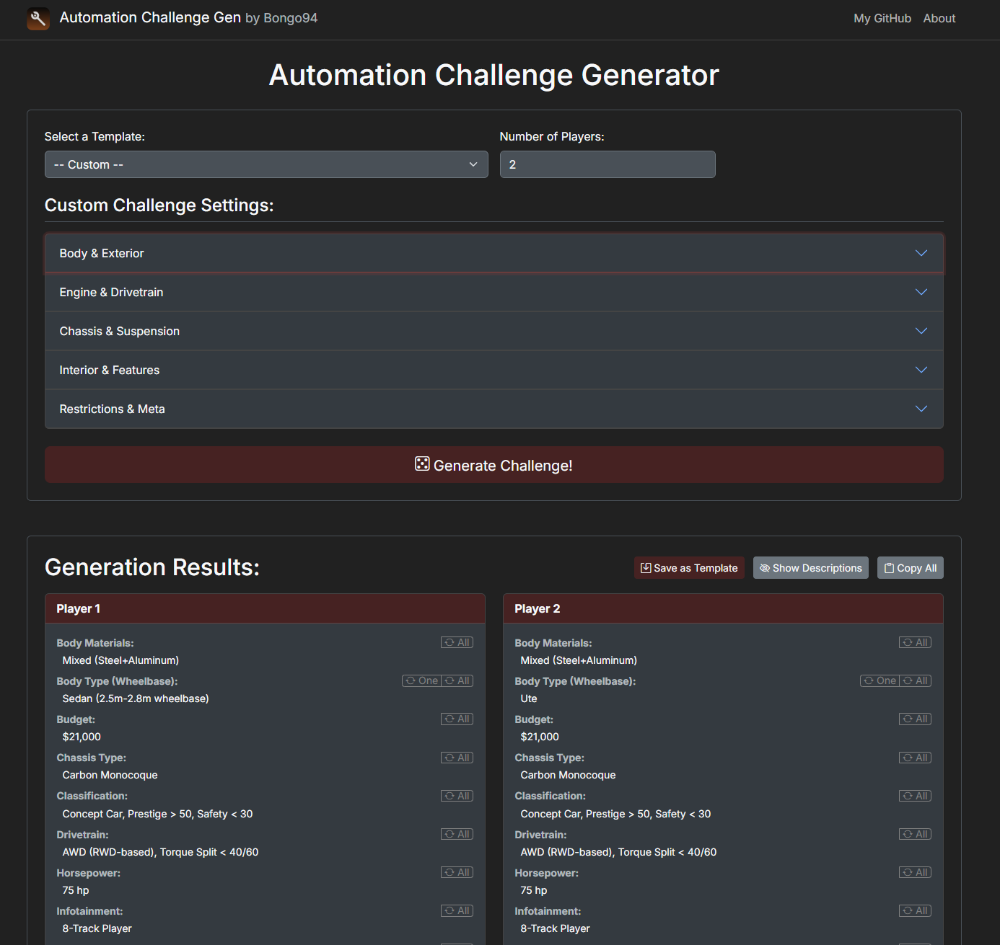

# Automation Challenge Generator

[](https://www.python.org/downloads/)
[](https://flask.palletsprojects.com/)
[](https://getbootstrap.com/)
[](https://opensource.org/licenses/MIT)
[](https://automation.bongo94.ru)

A web application for generating gameplay challenges for the car-building game, *Automation: The Car Company Tycoon Game*. It helps players create unique and structured design briefs, either from pre-defined templates or by using a highly customizable rule-based system.

This project is built with Flask and uses a dynamic, AJAX-powered frontend to provide a smooth user experience without page reloads.

---

## Table of Contents
- [Features](#features)
- [Screenshot](#screenshot)
- [Tech Stack](#tech-stack)
- [Installation and Setup (Local Development)](#installation-and-setup-local-development)
- [Deployment with Docker Compose & Nginx Proxy Manager](#deployment-with-docker-compose--nginx-proxy-manager)
- [Usage](#usage)
- [Project Structure](#project-structure)
- [Contributing](#contributing)
- [License](#license)

---

## Features

-   **Template-Based Generation**: Quickly generate challenges using pre-defined templates.
-   **Custom Rule Builder**: Create your own challenge rules for any category.
    -   Select a random value from all available options in a category.
    -   Select a random value from a user-defined list.
    -   Select a fixed, specific value.
    -   Generate a random number within a specified range (e.g., for budget or year).
-   **Multi-Player Support**: Generate unique (or the same) constraints for up to 10 players at once.
-   **Dynamic UI**: The interface is powered by AJAX, allowing for fast generation and "rerolls" without reloading the page.
-   **Reroll Functionality**:
    -   Reroll a specific category for a single player.
    -   Reroll a specific category and apply the new value to all players.
-   **Save Custom Templates**: Save your custom-built rule configurations as new templates for future use.
-   **Organized Interface**: Categories are grouped logically (e.g., "Body & Exterior", "Engine & Drivetrain") in an accordion for easy navigation.

---

## Screenshot



---

## Tech Stack

-   **Backend**: Python 3, Flask, Flask-SQLAlchemy, Flask-Migrate, Gunicorn
-   **Frontend**: JavaScript (ES6+), Bootstrap 5.3, HTML5, CSS3
-   **Database**: SQLite (default), easily configurable for PostgreSQL.
-   **Deployment**: Docker, Docker Compose, Nginx Proxy Manager

---

## Installation and Setup (Local Development)

Follow these steps to get the application running on your local machine for development.

### 1. Prerequisites
-   Python 3.8 or newer
-   `pip` package installer

### 2. Clone the Repository
```bash
git clone https://github.com/Bongo94/AutomationGame-Random-Challenge-Site
cd AutomationGame-Random-Challenge-Site
```

### 3. Create and Activate a Virtual Environment
It is highly recommended to use a virtual environment to manage project dependencies.

-   **On macOS/Linux:**
    ```bash
    python3 -m venv venv
    source venv/bin/activate
    ```
-   **On Windows:**
    ```bash
    python -m venv venv
    .\venv\Scripts\activate
    ```

### 4. Install Dependencies
```bash
pip install -r requirements.txt
```

### 5. Initialize the Database
This is a one-time command that sets up the database schema and populates it with initial data from `ready_data.json`.

```bash
flask init-app
```
This command will:
1.  Apply any existing database migrations.
2.  Seed the database with all the categories and values needed for the generator.

### 6. Run the Application
```bash
flask run
```
The application will be available at `http://127.0.0.1:5000`.

---

## Deployment with Docker Compose & Nginx Proxy Manager

This project is designed for easy deployment using Docker Compose for container orchestration and Nginx Proxy Manager for reverse proxying and SSL termination (Let's Encrypt).

### 1. Prerequisites (on your server)
-   Docker and Docker Compose installed.
-   Nginx Proxy Manager already set up and running on your server. Make sure you know the name of the Docker network that Nginx Proxy Manager uses (e.g., `proxy-net`). You can find this by running `docker network ls`.
-   A domain name (e.g., `automation.bongo94.ru`) pointing to your server's public IP address via A/AAAA records in your DNS provider settings.
-   Ports 80 and 443 are open on your server's firewall.

### 2. Clone the Repository
Log in to your server and clone the repository:
```bash
git clone https://github.com/Bongo94/AutomationGame-Random-Challenge-Site /srv/automation_website
cd /srv/automation_website
```

### 3. Configure Environment Variables
Create a `.env` file in the root of your project directory (`/srv/automation_website/`) to store sensitive environment variables:
```bash
nano .env
```
Add your Flask secret key:
```
FLASK_SECRET_KEY=your_very_strong_and_secret_key_here
```
Save and exit. **Ensure `.env` is in your `.gitignore` to prevent it from being committed.**

### 4. Update `docker-compose.yml` (if needed)
Open `docker-compose.yml` and ensure the `networks` section points to the correct external network used by your Nginx Proxy Manager (e.g., `proxy-net`).

```yaml
version: '3.8'

services:
  web:
    build:
      context: .
      dockerfile: Dockerfile
    container_name: automation_challenge_web
    restart: always
    environment:
      SECRET_KEY: ${FLASK_SECRET_KEY}
      FLASK_CONFIG: production
    volumes:
      - flask_data:/app/data
    networks:
      - your_npm_network_name # <-- Replace with your Nginx Proxy Manager network name (e.g., 'proxy-net')

volumes:
  flask_data:
    driver: local

networks:
  your_npm_network_name: # <-- Replace with your Nginx Proxy Manager network name (e.g., 'proxy-net')
    external: true
```

### 5. Build Docker Image
Build the Docker image for your Flask application:
```bash
docker compose build
```

### 6. Initialize the Database
This command will apply database migrations and seed the initial data. It needs to be run only once, or after major database schema changes:
```bash
docker compose run --rm web flask init-app
```

### 7. Run the Application Services
Start your Flask application container in detached mode:
```bash
docker compose up -d
```
Your Flask application will now be running and accessible within the Docker network at `http://web:5000`.

### 8. Configure Nginx Proxy Manager
Access the Nginx Proxy Manager web interface (typically `http://your_server_ip:81`) and create a new Proxy Host:

-   **Details Tab:**
    -   **Domain Names:** Enter your domain (e.g., `automation.bongo94.ru`).
    -   **Scheme:** `http`
    -   **Forward Hostname / IP:** `web` (This is the service name defined in `docker-compose.yml`)
    -   **Forward Port:** `5000` (This is the port Gunicorn listens on inside the container)
    -   Enable `Websockets Support`.
-   **SSL Tab:**
    -   **SSL Certificate:** Select `Request a new SSL Certificate` (for Let's Encrypt).
    -   Enable `Force SSL`.
    -   Agree to the Let's Encrypt Terms of Service.
    -   Click **Save**.

After a successful SSL certificate issuance, your application will be available via HTTPS at your domain!

---

## Usage

Once the application is running, open it in your browser (`https://automation.bongo94.ru`).

-   **To Generate**: Select a template or choose "Custom" to build your own rules. Set the number of players and click the "Generate Challenge!" button.
-   **To Reroll**: In the results area, each category has reroll buttons.
    -   The `One` button rerolls the value for that specific player only (if the "apply to all" rule wasn't used for that category).
    -   The `All` button rerolls the value and updates it for every player.
-   **To Save a Template**: After generating from a "Custom" configuration, a "Save as Template" button will appear. Click it to save your current rules for later use.

### Available CLI Commands (inside Flask container)
-   `docker compose run --rm web flask init-app`: The all-in-one command for first-time setup or full re-initialization. Creates the database schema and seeds it.
-   `docker compose run --rm web flask db upgrade`: Applies the latest database migrations. Use this after pulling changes that modify the database schema.
-   `docker compose run --rm web flask seed-db`: Populates or updates the database with data from `ready_data.json`. This is useful if you've updated the JSON data and want to sync it with the database without affecting the schema.

---

## Project Structure
```.
├── app/                      # Main Flask application package
│   ├── main/                 # Main blueprint for core routes and logic
│   ├── static/               # Static files (CSS, JS, images)
│   ├── templates/            # Jinja2 templates
│   ├── utils/                # Utility scripts (e.g., generator logic)
│   ├── __init__.py           # Application factory
│   └── models.py             # SQLAlchemy database models
├── data/                     # Data directory (for SQLite DB and JSON data)
│   └── ready_data.json
├── migrations/               # Flask-Migrate migration scripts (tracked by Git)
├── Dockerfile                # Defines the Docker image for the Flask app
├── docker-compose.yml        # Orchestrates the Flask app container
├── .env.example              # Example .env file (DO NOT COMMIT ACTUAL .env)
├── config.py                 # Configuration settings
├── run.py                    # Application entry point for Flask CLI / Gunicorn
├── seeding.py                # Database seeding script
├── requirements.txt          # Python dependencies
└── README.md                 # This file
```

---

## Contributing
Contributions are welcome! If you have suggestions for new features, categories, or improvements, feel free to open an issue or submit a pull request.

1.  Fork the Project
2.  Create your Feature Branch (`git checkout -b feature/AmazingFeature`)
3.  Commit your Changes (`git commit -m 'Add some AmazingFeature'`)
4.  Push to the Branch (`git push origin feature/AmazingFeature`)
5.  Open a Pull Request

---

## License
This project is licensed under the MIT License. See the `LICENSE` file for more details.
